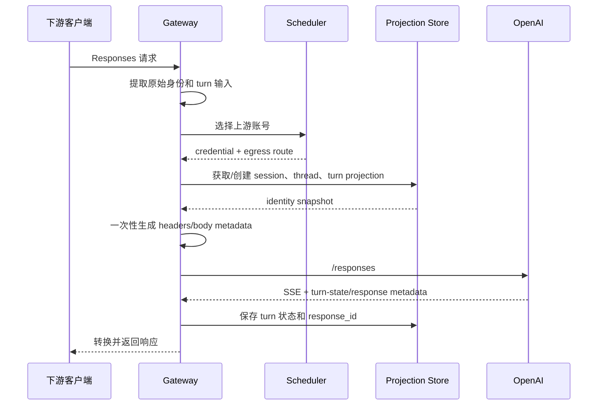

# Codex 身份与账号出站网络落地方案

> 状态：设计方案，仅供评审。本文不代表当前代码已经实现，也不包含本轮代码修改。
>
> 参考：OpenAI Codex 稳定版 `rust-v0.154.0`（`6b9826e3aa83b1a5947db50f4332cb9c65f1b340`）、
> 研究时的 `main` `3a589370a49ddf197de8e5ae03a92615bcad58bf`、
> `docs/CODEX_OUTBOUND_IDENTITY.md`、`docs/WS_IDENTITY_REUSE_REVIEW.md`，以及
> Linux.do 帖子《Codex Desktop → CLIProxyAPI → OpenAI 请求分析讨论可能的降智原因》的抓包记录。
> 公开协议语义同时对照 OpenAI 官方的 Responses WebSocket、Compaction、
> Image generation 和 Chat Completions → Responses 迁移文档。

## 1. 目标和边界

目标是让网关在多用户、多账号、HTTP、WebSocket、重试和账号切换场景下，形成可解释且内部一致的 Codex 请求：

- 同一个上游 OAuth 账号使用稳定的安装身份、客户端画像和出站网络。
- 同一个下游会话在同一个上游账号上保持稳定的 `session`、`thread`、`window` 和缓存键关系。
- 同一个 `turn` 的工具续接、重试、WebSocket 重连复用同一套 turn 状态。
- 心跳、预热、压缩、搜索、图片等辅助操作有明确的身份归属，不被误判为普通新 turn。
- Responses、Chat Completions、HTTP、SSE 和 WebSocket 经过同一分类器，协议转换不改变逻辑归属。
- 账号切换时清除旧账号的不可转移状态，避免把旧账号的响应链带到新账号。
- 入站用户之间相互隔离，但不把每个入站用户的真实 IP、代理头或部署内部标识发送给 OpenAI。
- 账号代理、出口 IP、时区和 locale 形成一致的账号级网络画像。

本文不承诺绕过上游风控，也不把“UA 改得像 CLI”当作目标。UA、originator、版本、TLS 和 attestation 必须遵循实际能力；不能通过伪造客户端 IP 或伪造 attestation 获得信任。

## 2. 参考模型：app-server 和 `/responses` 是两层协议

Codex 客户端通常先与 app-server 交互：

```text
initialize
  -> thread/start 或 thread/resume
  -> turn/start
  -> Core 组装 Responses 请求
  -> /responses 或 Responses WebSocket response.create
```

`thread/start`、`turn/start` 的 RPC 参数不能直接当作 `/responses` 字段。网关需要保留的是 Core 最终生成的身份关系和状态生命周期。

最终 `/responses` 请求的核心字段为：

```json
{
  "model": "...",
  "instructions": "...",
  "input": [],
  "tools": [],
  "tool_choice": "auto",
  "parallel_tool_calls": true,
  "reasoning": {},
  "store": false,
  "stream": true,
  "include": ["reasoning.encrypted_content"],
  "prompt_cache_key": "...",
  "text": {},
  "client_metadata": {}
}
```

Responses Lite 模式下，Codex 会把基础 instructions 放进 developer input item，顶层 `instructions` 为空并在序列化时省略。网关不应为了“看起来像 CLI”强行补发送 `"instructions": ""`。

### 2.1 事实与设计决策的边界

以下是 Codex 源码或 OpenAI 官方协议已经明确的事实：

- Codex 将请求区分为 `turn`、`prewarm`、`compaction`、`memory` 等 request kind。
- WS prewarm 是 `response.create + generate:false`，会返回可续接的 response ID。
- Responses WS 用 `stream_id` 表示连接内 lane，用 `previous_response_id` 表示 response lineage，两者不是同一个概念。
- remote compaction v2 使用 `compaction_trigger` 和当前 turn/window metadata，成功后 Codex 才推进窗口。
- 独立 `/responses/compact` 返回 compacted input window，不返回 response ID。
- Codex SearchClient 的 `/alpha/search` body 使用 session ID，并附带当前 turn metadata；它不使用 Responses turn-state。
- Codex ImagesClient 使用独立 `images/generations`、`images/edits` 协议；输入图片和 hosted image generation 也可以作为 Responses item/tool 存在。

以下是本文给 sub2api 的设计决策，不是 OpenAI 强制的公开协议字段：

- `CodexOperationEnvelope`、projection 表、operation ownership 和 lane ownership 的内部数据模型。
- 每个真实 OAuth 凭据绑定一个稳定 profile 和 egress route。
- prewarm 使用独立短期 admission、search/image 子 operation 绑定父 turn、窗口推进采用数据库原子提交。
- 无法无损转换状态语义时拒绝跨协议降级，而不是静默删字段。

## 3. 身份字段的规范关系

### 3.1 生命周期

| 字段 | 作用 | 生命周期 |
| --- | --- | --- |
| `installation_id` | 一套客户端安装身份 | 上游凭据/设备画像级 |
| `session_id` | 根线程及其子线程共享的会话树 | 长期会话级 |
| `thread_id` | 一个具体线程 | 线程级 |
| `turn_id` | 一次用户任务 | 单次任务级 |
| `root_turn_id` | 当前因果任务树的根 turn | 根 turn 等于自身；子 turn 指向映射后的根 turn |
| `parent_turn_id` | 直接触发当前 turn 的父 turn | 子任务级，可空 |
| `parent_thread_id` | 直接父线程 | 子线程级，可空 |
| `forked_from_thread_id` | fork 来源线程 | fork 线程级，可空 |
| `window_id` | 当前上下文窗口 | `{thread_id}:{window_number}` |
| `context_window_id` | 当前窗口实例 UUID | 压缩或新上下文窗口时更新 |
| `x-codex-turn-state` | 上游 sticky routing 状态 | 单个 turn |
| `previous_response_id` | Responses 链接 | 当前账号、thread 和 turn 的续接链 |

### 3.2 必须满足的相等关系

对于根线程：

```text
session_id == thread_id
x-client-request-id == thread_id
session-id == session_id
thread-id == thread_id
prompt_cache_key == session_id
x-codex-window-id == thread_id + ":" + window_number
root_turn_id == turn_id（根 turn）
```

对于子线程：

```text
session_id == 根线程的 session_id
thread_id != 父线程的 thread_id
x-codex-parent-thread-id == 父线程的 thread_id（如果是子代理/派生线程）
```

`client_metadata` 中的扁平字段、`x-codex-turn-metadata` 内嵌 JSON 和 HTTP/WS 头必须从同一个身份快照投影，不能分别哈希后再拼装。

`turn_id` 不能脱离谱系字段单独改写。根 turn 的 `root_turn_id` 必须同步映射为新的 `turn_id`；子 turn 的 `root_turn_id`、`parent_turn_id`、`parent_thread_id` 和 `forked_from_thread_id` 必须通过同一 projection store 解析到对应的新 ID。引用的父项尚未建立映射时，不能保留旧入站 ID 与新 ID 混发，应先建立父映射或拒绝无法证明关系的收敛。`context_window_id` 属于 thread/window 状态，也必须由同一身份快照生成和推进。

Codex `0.154.0` 的真实 HTTP 工具续接已经验证：根 turn 中 `root_turn_id == turn_id`，同一 turn 的第二次请求继续使用相同的 root/turn 身份，并回显第一次响应的 `x-codex-turn-state`。因此当前只改写 `turn_id`、保留原 `root_turn_id` 的实现会产生确定的身份矛盾。

### 3.3 窗口处理

初始窗口为：

```text
window_number = 0
window_id = thread_id + ":0"
context_window_id = UUIDv7
```

自动压缩后：

```text
window_number += 1
window_id = thread_id + ":" + window_number
context_window_id = 新 UUIDv7
```

当前实现固定使用 `thread_id:0`，后续必须由 thread projection 维护窗口编号和上下文窗口 ID。

## 4. 账号级完整身份画像

每个真实 OAuth 凭据建立一条稳定的 `codex_identity_profile`。影子账号不建立新的画像，而是解析到真实凭据源。

建议画像字段：

```text
credential_namespace       真实 ChatGPT 账号或不可逆凭据命名空间
installation_id            稳定 UUID
originator                 UA 前缀，例如 codex-tui 或 Codex Desktop
core_version               UA 第一个版本段
client_name                UA 尾部 clientInfo.name
client_version             UA 尾部 clientInfo.version
os_name / os_version       客户端画像声明的系统信息
architecture               x86_64、arm64 等
terminal_user_agent        iTerm、xterm 等终端段
timezone                   IANA 时区
locale                     搜索或地区相关 locale
egress_route_id            绑定的出站代理或直连路由
egress_generation          出口变更代次
profile_generation         UA/客户端画像变更代次
```

UA 采用 Codex 的完整格式：

```text
{originator}/{core_version} ({OS} {OS_version}; {arch}) {terminal}
({client_name}; {client_version})
```

`core_version` 和 `client_version` 是两个独立版本，不能互相填充。`/responses` 不额外发送 `version` 头；模型清单的 `client_version` 从同一画像读取。

系统设置中的 UA 如果为空，使用系统默认的 Codex 画像；如果填写，则必须能解析出完整 Core 版本和 clientInfo 版本。解析失败直接拒绝保存，不能自动猜版本或拼接第二套逻辑。

## 5. 出站网络和 IP 规则

### 5.1 上游实际看到的 IP

上游看到的 TCP 源 IP 由出站网络决定：

| 配置 | 上游看到的源 IP |
| --- | --- |
| 服务器直连 | 网关服务器公网 IP |
| 账号固定代理 | 该代理的出口 IP |
| 请求级随机代理 | 每次请求可能不同的代理出口 IP |
| `X-Forwarded-For` | 通常不改变 TCP 源 IP，只会额外暴露一个来源头 |

因此，不把入站用户 IP 转发给 OpenAI，不会导致上游自动看到每个用户的 IP。只有账号出站代理轮换，才会让同一账号出现多个源 IP。

### 5.2 推荐绑定策略

```text
OAuth 账号 A -> 固定代理 A -> 出口 IP A -> 账号时区 A
OAuth 账号 B -> 固定代理 B -> 出口 IP B -> 账号时区 B
```

同一个账号的 HTTP 请求、WebSocket 重连、工具续接和重试必须使用同一 `egress_route_id`。代理池不能按请求随机选择。

代理只在以下情况切换：

- 代理连接失败或连续健康检查失败；
- 代理被管理员禁用；
- 账号明确更换代理；
- 代理提供商回收出口。

切换代理时增加 `egress_generation`。正在执行的 turn 尽量完成或失败后再切换；新 turn 使用新路由。切换后不能继续复用旧连接、旧 `x-codex-turn-state` 或旧 `previous_response_id`。

### 5.3 来源头处理

入站的以下头不发送给 OpenAI：

```text
X-Forwarded-For
X-Forwarded-Host
X-Forwarded-Port
X-Forwarded-Proto
X-Real-IP
X-Real-Port
Remote-Host
```

这些头仅用于网关内部审计、限流和安全策略。它们不能替代真实 TCP 源 IP，也不能当作上游客户端身份字段。

## 6. 时区、locale 与环境上下文

IP 和时区是两个不同维度：IP由出站代理决定，时区由请求上下文决定。

推荐规则：

- 使用账号固定代理时，账号画像的默认 IANA 时区根据代理出口地区配置。
- 直连账号使用服务器实际出口地区对应的时区，不能使用入站用户时区覆盖账号画像。
- Codex 的 `<environment_context><timezone>` 属于模型可见上下文，不是 HTTP 头。
- 搜索请求中的 `locale`、`utc_offset`、`user_location.timezone` 单独处理，不能假设会从 IP 自动推导。
- `cwd`、shell、权限、文件系统等真实环境上下文继续来自下游客户端，不与账号画像混为一谈。

如果用户上下文中的时区与账号出口时区不同，系统应记录诊断信息并按产品策略决定是否拒绝、保留客户端上下文或使用账号默认值；不能悄悄在多个层面写入不同的时区。

### 6.1 第一阶段传输基线：稳定 Go 原生画像

第一阶段采用 `go-native-v1` 作为 OpenAI/Codex 账号的唯一默认传输画像。它使用当前 Go 运行时的 `crypto/tls`、`net/http`、`x/net/http2` 和 WebSocket 客户端的真实行为，不通过 uTLS 模拟 Node.js、浏览器或尚未测量的 Codex Rust ClientHello。

选择该基线的原因是当前代码启用 TLS 指纹后会使用从 Claude Code/Node.js 24.x 采集的 ClientHello、默认只声明 `http/1.1`，而 OpenAI WebSocket 又使用另一套 Go TLS transport。继续沿用会让同一账号在 HTTP、SSE、WebSocket 和不同代理协议之间呈现互相矛盾的传输画像。稳定的 Go 原生画像虽然不等同于官方 Codex，但其能力和实际实现一致，便于观测、复现和逐步验证。

`go-native-v1` 必须满足：

- HTTP、SSE、模型清单、额度探测、压缩、搜索和图片请求统一使用 Go 原生 TLS；OpenAI HTTP/2 设置统一生效。
- Responses WebSocket 和 Realtime WebSocket 使用同一账号的代理路由、证书策略和 profile generation；不得单独选择另一套伪装画像。
- 同一真实凭据固定一个画像版本和 `egress_route_id`，请求之间不随机选择 TLS profile。
- `User-Agent`、originator 和客户端版本仍由账号身份画像生成；它们描述应用层身份，不能改变或掩盖实际 TLS backend。
- 连接池 key 同时包含 Go 运行时版本、传输画像版本、代理路由、目标 host、协议模式、`profile_generation` 和 `egress_generation`。
- Go 版本、HTTP/2 配置或 WebSocket TLS 实现变化时，升级为新的传输画像版本并重建旧连接。
- HTTPS 代理、HTTP CONNECT、SOCKS 和直连必须分别验证最终目标 TLS；代理协议不得导致未记录的画像切换。

OpenAI/Codex 路径不再把“TLS 指纹已启用但没有绑定模板”解释成 Node.js 24.x，也不使用历史随机模板。其他平台若保留 uTLS，必须使用平台专用的显式 profile，不能成为 OpenAI 的隐式 fallback。

### 6.2 真实抓包与升级门槛

只有真实 Codex 样本证明需要更高传输一致性时，才从 `go-native-v1` 升级到版本化的 `codex-*` 画像。采集至少覆盖：

- 明确版本、操作系统和架构的官方 Codex CLI/Desktop；
- 普通 Responses HTTP/SSE 和 Responses WebSocket；
- ClientHello、JA3、JA4、ALPN、实际协商协议和 TLS backend；
- HTTP/2 SETTINGS、连接窗口、伪头与普通头顺序；
- WebSocket Upgrade、扩展、Ping/Pong 和连接复用；
- 直连以及生产实际使用的 HTTP、HTTPS、SOCKS 代理路径。

抓包记录必须注明客户端版本、构建来源、采集时间、操作系统、网络出口、代理方式和是否使用自定义 CA。认证 token、Cookie、完整 prompt、响应正文和账号标识不得写入抓包产物。

只有同时满足以下条件，才允许新增 `codex-*` profile：

1. 同一版本重复采集结果稳定；
2. HTTP 与 WebSocket 的差异可以解释为官方客户端自身行为；
3. Go 实现能同时复现 ClientHello、ALPN 和对应的 HTTP/2 或 WebSocket 行为；
4. 通过直连和目标代理集成测试；
5. profile 与明确的 Codex 版本和平台绑定，不能命名为无版本的“自动 Codex”。

如果 Go/uTLS 只能匹配 JA3/JA4，不能匹配 HTTP/2 和 WebSocket 行为，则继续使用 `go-native-v1`。确实要求复用官方 Rust 传输行为时，单独评估基于 `reqwest`、`rustls` 和 `tokio-tungstenite` 的 Rust transport sidecar；不能用修改 UA 代替传输实现。

### 6.3 首轮真实抓包结论

2026-09-17 已完成官方 `codex-cli 0.151.0`（Windows x86_64）和 `go-native-v1`（Go 1.26.7）的首轮透明 CONNECT 采集，并补充 `0.154.0` 真实生产请求及 HTTP 工具续接的应用层脱敏样本。详细方法、指纹和限制见 `docs/CODEX_TRANSPORT_CAPTURE_2026-09-17.zh-CN.md`。

首轮结果确认：

- Codex 普通 HTTP 使用平台 transport-default，Codex WS 使用 rustls，两者本来就不是同一个 JA3。
- Codex WS 两次握手的 extension 顺序和 JA3 不同，但归一化 JA4 相同，不能把固定 JA3 作为 Codex 身份条件。
- `go-native-v1/http-h2` 的 JA3、JA4、ALPN 和 HTTP/2 SETTINGS 重复采样稳定。
- `go-native-v1/ws-h1` 的 JA3、JA4 和 HTTP/1.1 Upgrade 行为重复采样稳定。
- 现有 Node.js 24.x uTLS 与所有 Codex 样本均不相符，继续采用 `go-native-v1` 作为第一阶段基线。

## 7. 映射表设计

不按每个 HTTP 请求写永久记录。建议使用三张持久表加一层短期状态存储。

### 7.1 `codex_identity_profiles`

一个真实上游凭据一条。

```text
id
credential_namespace UNIQUE
account_id
installation_id UNIQUE
originator
user_agent
core_version
client_name
client_version
os_name
os_version
architecture
terminal_user_agent
timezone
locale
egress_route_id
egress_generation
profile_generation
created_at
updated_at
```

### 7.2 `codex_session_projections`

一个下游 API Key 在一个上游凭据上的入站 session 映射一条。

```text
id
api_key_id
credential_namespace
ingress_session_hash
upstream_session_id
upstream_root_thread_id
prompt_cache_key
profile_generation
egress_generation
created_at
last_seen_at
```

唯一约束：

```text
(api_key_id, credential_namespace, ingress_session_hash)
```

### 7.3 `codex_thread_projections`

保存具体线程、父子关系和窗口状态。

```text
id
session_projection_id
ingress_thread_hash
upstream_thread_id
upstream_parent_thread_id
forked_from_thread_id
window_number
window_id
context_window_id
created_at
last_seen_at
```

唯一约束：

```text
(session_projection_id, ingress_thread_hash)
```

### 7.4 `codex_turn_projections`

保存短期 turn 状态，可放 Redis；需要审计时再落库。

```text
thread_projection_id
ingress_turn_hash
upstream_turn_id
upstream_root_turn_id
upstream_parent_turn_id
turn_state
last_response_id
profile_generation
egress_generation
status
expires_at
```

唯一约束：

```text
(thread_projection_id, ingress_turn_hash)
```

TTL 到期后不能凭猜测恢复 `turn_state` 或 `previous_response_id`。如果请求还需要继续上游链路，应要求客户端重发可重放历史，或保持账号粘连直到链路结束。

## 8. HTTP 请求流程



具体规则：

1. 在 body 转换、账号命名空间投影前提取原始 `session-id`、`thread-id`、`turn_id`、`prompt_cache_key` 和内嵌 turn metadata。
2. 选定账号后只创建一次 immutable identity snapshot。
3. 身份快照同时负责 UA、originator、版本、安装 ID、session、thread、turn、window、cache key 和代理路由。
4. 传输重试复用同一快照；账号 failover 才创建新账号快照。
5. failover 后清除旧账号的 turn state、WebSocket 连接和 previous response ownership。
6. 只有明确属于同一入站 turn 的工具续接才能复用 turn projection。
7. root、parent、fork 和 context window 引用必须先经 projection store 解析，再一次性写入 flat metadata、内嵌 turn metadata 和 headers；不能只替换当前 `turn_id`。

## 9. WebSocket 状态机

一个 WebSocket 连接可以复用给多个 turn，也可以通过 `stream_id` 承载多个并行 lane；一个 turn 内又可能包含多个 `response.create`。因此不能把“连接”“lane”“response.create”和“turn”合并成一个概念。

```text
IDLE
  -> TURN_ACTIVE（首次 response.create）
  -> TOOL_WAITING（收到 function_call）
  -> TURN_ACTIVE（function_call_output / response.create）
  -> TURN_ACTIVE（同 turn 的重试或重连）
  -> TURN_COMPLETED（最终响应完成）
  -> IDLE
```

状态要求：

- `turn_id` 在 `TURN_ACTIVE` 全程保持不变。
- `x-codex-turn-state` 只在该 turn 的后续请求中发送。
- WebSocket 重连可以换连接，但不能换 turn 身份。
- `stream_id` 是连接内的有序 lane，不是 session、thread 或 turn ID。
- 同一 `stream_id` 内的请求 FIFO 且不重叠；不同 `stream_id` 可以并行，事件必须按 `stream_id` 分派。
- lane 状态至少按 `(credential_namespace, connection_id, stream_id)` 隔离，并记录绑定的 thread、turn 和 latest response ownership。
- 省略 `stream_id` 的默认 lane 也必须有独立状态，不能与任意命名 lane 混用。
- 账号、代理、UA、originator、版本或硬能力变化时，连接不能复用。
- 失败、取消、帧顺序不明或 response ownership 不明的连接直接退役。
- `previous_response_id` 只能在同一账号、thread 和可验证 response ownership 下继续。
- `store=false` 下连接重建会丢失 connection-local response cache；无法验证旧 response ID 时必须重放完整 input，不能盲目续接。

官方 WebSocket 当前允许一个连接最多 16 个 active response 和 32 个命名 `stream_id`。这两个值应作为上游能力约束记录，网关自身的并发上限仍由账号调度配置决定。

## 10. 统一请求分类器

所有入口先分类，再选号、生成身份、转换协议。不能先把 Chat Completions 转成 Responses，再根据转换后的 JSON 猜它原本属于哪种生命周期。

建议建立不可变的 `CodexOperationEnvelope`：

```text
operation_id             网关生成的单次操作 ID
operation_kind           generation / prewarm / compaction / token_count /
                         search / image / cancel / background / probe /
                         transport_control
inbound_protocol         responses / chat_completions / alpha_search / images
upstream_protocol        responses / chat_completions / alpha_search / images / local
transport                http_json / http_sse / websocket
continuity               independent / same_turn / new_turn / window_transition
parent_turn_projection   可空；工具或辅助操作所属的 turn
stream_id                仅 Responses WebSocket lane 使用
account_required         是否需要上游账号
model_slot_required      是否占用模型生成槽位
billable_mode            tokens / per_call / image / none
```

分类顺序固定为：

1. 根据真实入口 path、method、upgrade、`Content-Type` 和 WS event type 判定传输协议。
2. 根据原始 body 判定 `generate:false`、`compaction_trigger`、hosted tool、输入图片和独立图片任务。
3. 从原始请求提取 session/thread/turn/parent/response lineage，生成 operation envelope。
4. 选号后将账号 profile、egress route 和 projection 绑定到 envelope。
5. 最后才做 Chat Completions ↔ Responses、compact bridge 或工具模拟等线格式转换。

核心约束：

- HTTP、SSE、WebSocket 是传输方式，不决定是否为新 turn。
- 文本、输入图片、hosted search、hosted image generation 是 turn 内容，不分别创建会话。
- 独立 `/alpha/search`、`/images/*` 是辅助 operation；有父 turn 时关联父 turn，没有父 turn 时保持独立，不伪造用户 turn。
- 协议转换不赋予原协议不存在的 `previous_response_id`、`x-codex-turn-state` 或 Responses window 语义。
- 转换目标无法表达源请求的状态语义时，必须选择原生支持的账号，或在发送前明确拒绝；不能静默删除状态字段。

## 11. 心跳、保活和预热

### 11.1 WebSocket Ping/Pong

协议 `Ping/Pong` 只属于 transport connection：

- 不创建 session、thread、turn 或 operation projection；
- 不进入模型并发槽，不产生用量，不更新账号 `last_used`；
- 不更新 `x-codex-turn-state`、`previous_response_id`、window 或缓存键；
- 只刷新连接健康状态和 idle deadline；
- Ping 失败只淘汰该物理连接，不能直接把账号判为模型不可用。

### 11.2 SSE/JSON keepalive

等待上游首字节、并发槽或 unary compact/image 结果时写给下游的 SSE 注释、空白或 JSON padding 都是 downstream-only transport padding：

- 不转发给 OpenAI；
- 不记为模型输出、首 token、工具结果或可见响应；
- 不阻断首个语义字节前的安全 failover；
- 一旦提交 HTTP 200，后续错误必须用对应协议的 terminal error event 结束，不能把 JSON 错误拼到 SSE 后面。

### 11.3 `generate:false` 预热

预热不是 Ping。Codex 和 OpenAI WebSocket 都使用真实 `response.create`，设置 `generate:false`，并返回可被 `previous_response_id` 引用的 response ID。

规则如下：

- 继承同一账号 profile、固定 egress、session、thread、window 和 `prompt_cache_key`；
- `request_kind=prewarm`，不创建新的用户 turn；有待启动 turn 时绑定该 turn 的 projection；
- 返回的 response ID 记录为该账号、连接、lane、thread 的 prewarm ownership；
- 不占用长生命周期模型生成槽，但进入短期 control/prewarm admission，防止无限预热；
- 没有模型输出时不按模型 token 计费；如果上游未来返回实际 usage，则按真实 usage 记录，不能硬编码免费；
- 预热失败可以重建连接并在同账号重试；切账号后必须重新预热，旧 response ID 不可转移。

### 11.4 取消、background 和探测

- `response.cancel` 或 `/{response_id}/cancel` 是已有 response operation 的控制动作。必须根据 response ownership 回到原账号、原连接/lane 或原 endpoint；不创建 turn、不换号，也不产生新的模型用量。
- WebSocket close 只结束连接。它会使 `store=false` 的 connection-local cache 失效，但不自动删除持久 session/thread projection。
- Codex `request_kind=memory` 是 background operation，源码不会自动给它 thread/window identity。网关可以内部记录触发来源，但不能为它伪造普通用户 thread/window。
- 模型清单、能力探测、账号测试和用量查询属于 account-level probe。它们继承账号 profile/egress 以保持出站一致，但不使用 session/thread/turn、prompt cache、turn-state 或 response lineage。
- probe 失败只更新对应能力或健康信号；除非响应明确证明凭据失效，不能把探测端点不支持等同于整个账号失效。

## 12. 压缩生命周期

压缩分三种协议，不能共用一个“compact=true”分支：

1. `context_management`：压缩发生在普通 Responses 生成内部，继续使用最新 `previous_response_id`。
2. Codex remote compaction v2：`POST /responses` 或 WS `response.create`，input 末尾含一个 `compaction_trigger`，`request_kind=compaction`。
3. 独立 `/responses/compact`：返回新的 compacted input window，不返回可续接的 response ID；下一次生成必须以该 window 重新开链。

身份和状态规则：

- turn 内自动触发的 remote compaction v2 复用当前 `turn_id`；显式手动压缩 turn 使用客户端已经创建的 compaction turn，不额外伪造一个用户 turn。
- 额外生成 `compaction_operation_id`，用来幂等、审计和防止重复推进窗口。
- 请求携带压缩前的 `window_id/window_number/context_window_id`；只有收到合法 terminal success 且恰好一个 compaction output item 后，才原子提交新窗口。
- 成功提交执行 `window_number += 1`、`window_id = thread_id:window_number`、生成新 `context_window_id`，并记录 old → new 关系。
- 超时、取消、SSE 断流、`response.failed`、0 个或多个 compaction item 都不推进窗口。
- `/responses/compact` 的输出归属当前 thread/window，但不能写入 `last_response_id`；随后创建 response 时省略或置空 `previous_response_id`，完整携带 compacted input。
- 同账号模型 fallback 只能更换 compact model，必须复用 operation、turn、profile 和 egress；账号 failover 只有在输入窗口完整可重放且没有语义输出时允许。
- compact SSE keepalive 只是下游保活，不属于 compaction output，也不能阻止首个语义事件前的 failover。
- 输入图片按 Codex 的 compaction image budget 保留或裁剪；不能只保留文字摘要而无条件丢弃图片内容。

## 13. 搜索生命周期

搜索分为三条链：

### 13.1 Responses hosted `web_search`

这是当前 Responses turn 的 hosted tool：

- 继承 turn 的 session/thread/turn/window、账号 profile、固定 egress、turn-state 和 response lineage；
- 搜索 call ID、结果和引用属于当前 response output；
- 模型和搜索调用分别按真实 usage/调用次数计费，但不能再创建一个伪 Codex turn；
- failover 必须遵守当前 turn 是否已有可见输出和 response ownership 的限制。

### 13.2 `/v1/alpha/search`

Codex `SearchClient` 使用独立 `SearchRequest` 协议，body 的 `id` 是 session ID，并发送当前 `x-codex-turn-metadata`；它不是 `/responses` 子路径。

- 由工具调用触发时，`parent_turn_projection` 指向调用它的 turn，账号默认粘连到父 turn 的账号；
- 发送 projected session ID 和父 turn metadata，但不发送 `x-codex-turn-state`、`previous_response_id`、Responses Lite 状态、`prompt_cache_key` 或 Responses beta 头；
- 直接作为公开 endpoint 调用且没有父 turn 时，创建独立 search operation，不伪造 turn；
- PAT 通过 hosted `web_search` fallback 时，逻辑上仍是同一个 search operation，不能因此改成新用户 turn；
- body、结果引用和 encrypted output 的 ownership 以 search operation 记录，不能混进主 Responses 的 `last_response_id`。

### 13.3 本地 search emulation

本地 Brave/Tavily 等搜索不经过 OpenAI：

- 结果作为调用 turn 的 tool output 返回，call ID 保持不变；
- 搜索供应商看到的出口由 `effective_search_route` 决定。显式配置 provider proxy 时使用该代理，否则默认继承账号 egress route；
- provider route 与账号 route 不同必须记录，不能在日志或 metadata 中声称两者是同一出口；
- 搜索 provider 凭据、配额和错误只影响 search operation，不能把 OpenAI OAuth 账号标为失效。

位置相关字段从账号画像生成默认值：

- `settings.user_location.timezone` 使用账号出口对应的 IANA 时区；
- `time[].utc_offset` 在请求时刻由该 IANA 时区计算，包含夏令时变化；
- `locale/country/region/city` 默认与 effective search route 一致；
- 用户明确要求搜索其他地区时，该地区是查询条件，不修改账号长期画像和 egress 绑定。

## 14. 图片生命周期

图片至少分为五类：

1. Responses/Chat Completions 中的 input image：属于当前 turn 的内容 item，继承当前身份和 response lineage。
2. Responses hosted `image_generation`：属于当前 turn 的 hosted tool call，结果是 `image_generation_call` output item。
3. `/v1/images/generations` 和 `/v1/images/edits`：独立 image operation；由 Codex 工具触发时可关联父 turn metadata，但不复用 turn-state 或 `previous_response_id`。
4. 异步/批量图片：以 `batch_id/task_id` 为主身份，创建时固定 `account_id/profile_generation/egress_generation`，轮询、下载、清理和结算继续使用原账号归属。
5. 工具结果或搜索结果中的图片：只是父 operation 的内容，不建立新的账号身份。

具体规则：

- input image 的 URL、file ID、data URL 或内容哈希是媒体引用，不是 session/thread/turn ID。
- Chat Completions ↔ Responses 转换必须保留图片的顺序、detail、MIME/URL 语义和 tool call 配对。
- hosted image generation 使用主 Responses response ID 和 turn-state；独立 Images API 使用自己的 `x-codex-imagegen-request-id`/operation ID，不写入主 turn 的 `last_response_id`。
- 独立 image operation 仍继承选定账号的 UA、originator、固定 egress 和 TLS profile；有父 turn 时优先粘连父账号，没有父 turn 时独立选号。
- batch task 一旦提交成功，后续状态查询不能换号；账号不可用时将任务标记为待恢复或失败，不能到另一账号猜测同名 provider task。
- 图片输出保存位置、下载 URL、对象存储 key 和 CDN URL 都不能参与身份派生。
- 图片 JSON/SSE keepalive 只用于下游保活，不计为图片结果；只有实际 partial/final image event 或成功 JSON data 才进入计费和完成状态。

## 15. 协议与传输矩阵

| 入站/事件 | 实际上游 | 逻辑归属 | `turn-state` / `previous_response_id` | 并发与计费 | failover 边界 |
| --- | --- | --- | --- | --- | --- |
| `/v1/responses` HTTP JSON/SSE | 原生 Responses 或兼容转换 | session/thread/turn 下的 generation operation | 原生支持时按 ownership 使用 | 占模型槽；按 usage | 首个语义输出前且状态可重放时允许 |
| Responses WS `response.create` | Responses WS | connection + lane + thread/turn + response operation | lane 内验证 ownership；可跨 lane fork | 每个 active generation 占模型槽；按 usage | lane 级失败不污染其他 lane；换账号需新连接 |
| WS Ping/Pong | 无模型请求 | connection | 均不使用 | 不占模型槽、不计费 | 失败只淘汰连接 |
| WS `generate:false` | Responses WS | thread/window 下的 prewarm operation | 产出 response ID，可供后续链引用 | 短期 control admission；无实际 usage 不计费 | 同账号可重试；换账号重新预热 |
| `response.cancel` / `/{id}/cancel` | 原 response 所属 endpoint | 原 response operation 的控制动作 | 按 response ownership 定位 | 不新增模型槽/计费 | 不允许换号 |
| SSE/JSON keepalive | 无上游或仅下游 padding | transport | 均不使用 | 不占槽、不计费 | 不应阻断语义输出前 failover |
| `/v1/chat/completions` HTTP JSON/SSE | 原生 Chat Completions 或转换后 Responses | 每请求一个 generation；会话状态由客户端 messages 管理 | 不自动创建 Responses 状态 | 占模型槽；按 usage | 完整 messages 可重放且未输出时允许 |
| Chat Completions → Responses | Responses | 保留原 Chat operation 归属 | 不凭转换自动注入；仅使用明确、可验证的兼容状态 | 占模型槽；按 Responses usage 回映 | 转换可重放且未输出时允许 |
| Responses → Chat Completions | Chat Completions | 保留原 Responses operation 归属 | 依赖 Responses-only 状态时禁止降级 | 占模型槽；按上游 usage 回映 | 只允许无状态且可完整重放的请求 |
| remote compaction v2 | `/responses` HTTP/SSE/WS | 当前 turn 的 compaction operation | 使用当前 turn metadata；成功后推进 window | 占 compact/model 槽；按真实 usage | 仅完整输入、无语义输出时允许 |
| `/responses/compact` | compact endpoint | thread/window 的 compaction operation | 不产生 response ID；下一链从 compacted input 开始 | 占 compact/model 槽；按真实 usage | 同上 |
| `/responses/input_tokens` | 当前实现为本地估算 | stateless token-count operation | 均不使用 | 不选账号、不占账号槽、不计模型费 | 无账号 failover |
| Responses hosted `web_search` | Responses hosted tool | 当前 turn/tool call | 继承当前 Responses 状态 | 模型槽 + search call 计费 | 遵守当前 turn 输出边界 |
| `/v1/alpha/search` | SearchClient 或 hosted fallback | search operation，可关联父 turn | 仅父 turn metadata；不用 turn-state/response chain | 独立 search admission；按次计费 | 无输出前换支持该端点的账号 |
| 本地 search emulation | Brave/Tavily 等 provider | 父 turn 的 tool operation | 不使用 OpenAI 状态字段 | provider 配额/按次计费 | provider 级切换，不改 OpenAI 账号状态 |
| Responses/Chat input image | 随主模型请求 | 当前 turn 内容 | 随主请求 | 随模型 token/图片输入计费 | 随主请求 |
| Responses `image_generation` | Responses hosted tool | 当前 turn/tool call | 继承当前 Responses 状态 | 模型槽 + 图片计费 | 遵守当前 turn 输出边界 |
| `/v1/images/generations`、`edits` | Images API 或 Responses bridge | 独立 image operation，可关联父 turn | 不复用主 turn-state/response ID | 图片槽；按图片 usage | 首张/首个 partial 输出前允许 |
| batch image submit/poll/download | provider batch API | 独立 batch task | 不使用 | 异步任务槽；按结算结果 | submit 成功后固定账号，不跨号猜任务 |
| Codex background memory | Responses 或内部服务 | background operation，可记录触发来源 | 不自动使用 thread/window continuation | 按真实 usage | 只有完整输入且无输出时允许 |
| models/capability/usage probe | 账号控制 endpoint | account-level probe | 不使用 | 不占用户模型槽；不记用户生成费 | 可换探测账号，但结果分别归属 |
| `/v1/completions` | 当前仓库未提供该路由 | 不适用 | 不适用 | 不适用 | 若未来增加，必须单独设计，不能别名到 Chat Completions |

凡是实际请求 OpenAI 的行，都继承账号 profile、固定 egress、TLS profile 和 profile/egress generation。本地 token count、纯 transport keepalive 不建立上游画像；本地 search provider 使用独立记录的 effective search route。

## 16. 请求字段处理清单

| 字段 | 处理方式 |
| --- | --- |
| `Authorization` | 入站网关 key 换成选定账号的 OAuth 凭据 |
| `ChatGPT-Account-Id` | 使用真实 OAuth 账号 ID |
| `User-Agent` | 使用账号 profile 的完整 UA；不写死旧版本 |
| `originator` | 与 UA 前缀一致 |
| `version` | `/responses` 不添加；模型目录从 profile 的 client version 生成查询参数 |
| `session-id` / `session_id` | 使用 projected session |
| `thread-id` / `thread_id` | 使用 projected thread |
| `x-client-request-id` | 根线程和普通 Codex 请求使用 projected thread |
| `turn_id` | 使用 projected turn；同 turn 重试不变 |
| `root_turn_id` | 根 turn 等于 projected turn；子 turn 指向 projected root turn |
| `parent_turn_id` | 映射为 projected parent turn；无法解析时不混用旧 ID |
| `parent_thread_id` / `forked_from_thread_id` | 映射为对应 projected thread，并与父线程头一致 |
| `x-codex-window-id` | `projected_thread_id:window_number` |
| `context_window_id` | 写入 turn metadata，压缩后更新 |
| `prompt_cache_key` | 根线程默认等于 projected session；内部子代理按 Codex 规则处理 |
| `x-codex-turn-metadata` | 从同一快照生成，并与 body metadata 对齐 |
| `x-codex-turn-state` | 只从当前账号、thread、turn 状态中读取 |
| `previous_response_id` | 必须通过当前账号和 thread 的 ownership 校验 |
| `x-oai-attestation` | 仅转发宿主真正生成的 opaque token；网关不伪造 |
| `X-Forwarded-*` / `X-Real-*` | 不发往 OpenAI |
| `instructions` | 遵循 Responses/Responses Lite 原始语义，不强补空字符串 |
| `stream_id` | 仅用于 Responses WS lane；不派生 session/thread/turn |
| `generate:false` | 标记 prewarm operation；返回的 response ID 按账号/连接/lane 归属 |
| `x-codex-imagegen-request-id` | 仅归属独立 image operation，不写入主 Responses response chain |

`x-codex-turn-state` 与 `previous_response_id` 也不是同一个状态：前者是 Codex 同一 turn 内的 sticky routing 状态，后者是 Responses 的 response lineage。一次工具续接可能同时需要两者；新 turn 必须清空旧 `turn-state`，但是否使用 `previous_response_id` 取决于上游协议、store 模式和 ownership。不能因两者都与“续接”有关就互相替代。

## 17. 账号切换与失败处理

### 17.1 可以切换账号的情况

- 请求尚未向上游发送；
- 上游在没有可见输出前返回可重试错误；
- 当前请求没有依赖旧账号的 `previous_response_id` 或 turn state；
- 已有完整历史，可以在新账号重建上下文。

### 17.2 必须保持账号粘连的情况

- 客户端正在提交工具输出；
- 请求依赖旧账号的 `previous_response_id`；
- 请求依赖旧账号的 `x-codex-turn-state`；
- 上游已经产生部分可见输出；
- 当前 WebSocket turn 仍处于 active 状态。
- alpha/search 或独立 image operation 已绑定父 turn 且父 turn 不可重放。
- batch image 已成功提交并取得 provider task ID。

### 17.3 切换动作

账号 failover 时必须同时：

1. 结束旧账号的 turn projection；
2. 丢弃旧账号的 `x-codex-turn-state`；
3. 关闭或隔离旧账号 WebSocket；
4. 清除旧 response ownership；
5. 使用新账号、新代理、新 profile generation 创建新的 projection；
6. 只有在历史可重放时才重建 `previous_response_id` 语义。
7. 关闭旧账号所有 lane 的 response ownership，不能只清理默认 lane。
8. search/image 子 operation 随父 turn 失败或在新账号重新创建，不能转移旧 provider operation ID。

这里的“结束旧账号 turn projection”是 failover 的失败终态，不表示抹掉审计记录。新账号必须创建新的 turn attempt；只有历史可重放时，才能让它继续服务同一个下游逻辑 turn。这样既保持客户端视角连续，也不会把两个上游账号的 turn-state/response ownership 混在一条记录中。

## 18. 并发、缓存和连接池

- 同一 `(credential, thread, turn)` 的更新必须原子化，避免并发请求分别创建两个 turn ID。
- 第一个请求负责创建 projection，后续请求等待数据库唯一约束或 Redis 分布式锁完成。
- `prompt_cache_key` 不得加入连接 ID、请求 ID、token 或随机盐。
- 同一账号不同下游用户可以共享传输连接，但必须满足 UA、originator、版本、代理、认证主体、目标 URL 和能力完全兼容。
- 活跃请求不因画像更新被强制中断；新画像只应用于新连接和新 turn。
- 失败或不明确的连接不回池，避免跨用户或跨账号串响应。
- 模型并发按 active generation/compaction/image operation 计数，不按 WebSocket 连接数计数。
- Ping/Pong 和下游 keepalive 不占账号模型槽；prewarm 使用独立的短期 admission。
- 同一 WS lane FIFO，不同 lane 的 active operation 分别占槽；连接级上限不能替代账号级并发限制。
- 连接池 key 必须包含 credential namespace、profile generation、egress generation、目标 host、协议能力和 UA/TLS profile。

## 19. 落地顺序

### 阶段一：统一分类与只读观测

- 先实现 `CodexOperationEnvelope`，覆盖所有矩阵行，并只记录分类结果。
- 记录入站身份摘要、选定账号、代理路由、出口代次和投影结果。
- 记录 header/body metadata 是否满足相等关系。
- 记录请求是否发生账号切换、连接/lane 复用、turn 续接和辅助 operation。
- 日志中只保留哈希或截断 ID，不记录 token、完整 prompt 和完整 metadata。

### 阶段二：统一身份快照

- 统一 HTTP、普通 WS、Passthrough WS 的身份入口。
- 移除按字段 `kind` 分别派生造成的关系破坏。
- 让 `off` 真正表示不做账号身份收敛；账号级必要的认证隔离仍单独处理。
- 让 `session/thread/request` 遵守 Codex 的相等关系。

### 阶段三：持久 projection

- 增加 identity profile、session projection、thread projection。
- 加入唯一约束和并发创建锁。
- 维护窗口编号、context window ID、parent/fork 关系。

### 阶段四：turn、operation 和 WebSocket lane

- 增加短期 turn projection 和 TTL。
- 增加 operation ownership 和 `(connection, stream_id)` lane 状态。
- 把工具续接、WS 重连、HTTP 重试绑定到同一 turn/operation。
- 在账号切换和认证主体变化时清理 turn state。

### 阶段五：辅助协议

- 接入 prewarm、remote compaction v2、standalone compact 和本地 input token 分类。
- 接入 hosted/standalone/emulated search 的父 turn 与路由归属。
- 接入 input image、hosted image generation、独立 Images API 和 batch task 归属。
- 统一所有 SSE/JSON keepalive 的 transport-only 记账规则。

### 阶段六：出站网络

- 为账号绑定固定代理或固定直连路由。
- 增加代理健康状态和 `egress_generation`。
- 禁止请求级随机代理。
- 将时区、locale 和代理出口配置关联到 profile。
- 为本地 search provider 记录 effective search route，并校验 location/timezone。
- 将 OpenAI/Codex 默认传输画像切换为 `go-native-v1`，统一 HTTP、SSE 和 WebSocket 的代理、证书和连接代次。
- 删除 OpenAI 未绑定 TLS 模板时隐式使用 Node.js 24.x 和历史随机模板的行为。
- 完成官方 Codex HTTP/WS 的版本化抓包；在满足第 6.2 节门槛前不增加推测性的 Codex uTLS profile。

### 阶段七：删除旧路径

- 删除 `off/device/session/full` 四套互相重叠的投影逻辑。
- 删除固定旧 UA、额外 `version` 头和强补空 `instructions` 的兼容代码。
- 删除固定 `thread:0` 的窗口实现。
- 删除转换后重新猜请求类型、静默丢弃状态字段和跨协议伪造 continuation 的路径。
- 保留必要的协议字段映射，但不保留两套运行时语义。

## 20. 验收标准

### 身份一致性

- 根线程满足 `session == thread == x-client-request-id`。
- body、flat metadata、turn metadata 和 headers 的身份字段一致。
- 同一 turn 的重试和工具续接使用同一 `turn_id`。
- 根 turn 满足 `root_turn_id == turn_id`；子 turn 的 root、parent、fork 引用全部指向同一命名空间内已映射的 ID。
- 压缩后 `window_number` 递增，`context_window_id` 更新。
- 相同逻辑请求经 HTTP、SSE、WS 或 Chat/Responses 转换后，operation/session/thread/turn 归属不变。

### 传输和 lane

- Ping/Pong、SSE 注释和 JSON padding 不创建 turn、不计费、不阻断首个语义字节前的 failover。
- prewarm 返回的 response ID 只能在原账号、连接/lane 和 thread ownership 内续接。
- 同 lane FIFO，不同 lane 事件交错时不会串 response、turn-state 或 usage。
- `store=false` 连接重建后不会盲目使用已丢失的 `previous_response_id`。
- cancel 总能按 ownership 路由到原 response，且不会因失败换到另一个账号。

### 压缩、搜索和图片

- compact 只有在 terminal success 且恰好一个 compaction item 后推进窗口；失败不推进。
- `/responses/compact` 输出不会被记录成 `last_response_id`。
- alpha/search 继承父 turn metadata，但不携带 Responses turn-state、cache key 或 response chain。
- hosted search/image 属于当前 turn；独立 search/image 使用子 operation；batch image 固定原账号。
- 图片在协议转换和 compaction 后保持顺序、引用、detail 和允许保留的内容。
- background memory 和 account probe 不会生成伪造的普通用户 thread/window。

### 网络一致性

- 同一账号连续请求使用同一 `egress_route_id` 和出口 IP。
- 多个下游用户共用一个账号时，上游看到的是账号出口，而不是用户入站 IP。
- 代理切换会增加 `egress_generation`，旧连接和旧 turn state 不再复用。
- 所有来源转发头不会发送到 OpenAI。

### 故障安全

- 并发创建同一 projection 只产生一条记录。
- 账号切换不会把旧账号 response ID 或 turn state 带到新账号。
- 失败、取消、乱序和无归属帧不会进入连接池。
- TTL 到期后不会猜测恢复旧 turn。

### 画像一致性

- UA、originator、Core 版本和 clientInfo 版本可互相解析。
- `/responses` 不出现额外 `version` 头。
- attestation 只使用真实宿主提供的 opaque token。
- 代理地区、时区和 locale 的配置来源可追踪。
- hosted 工具继承账号 egress；本地 search provider 的独立 egress 差异可追踪。
- OpenAI/Codex 默认使用 `go-native-v1`，不存在 Node.js 24.x 或随机 TLS profile 的隐式 fallback。
- 同一账号的 HTTP/SSE/WS 使用同一 profile generation、egress generation 和代理路由。
- 日志能够记录实际 TLS backend、ALPN、协商协议和连接池 profile key，但不记录认证材料。
- 抓包回归同时校验 ClientHello、HTTP/2 和 WebSocket，不能只比较 JA3/JA4。

## 21. 当前代码对照结论

当前仓库已经有身份快照、账号命名空间、指纹 seed、WS 连接复用边界和 turn-state 溯源的部分基础，相关记录见：

- `docs/CODEX_OUTBOUND_IDENTITY.md`
- `docs/WS_IDENTITY_REUSE_REVIEW.md`
- `backend/internal/service/openai_codex_account_identity.go`
- `backend/internal/service/openai_codex_attempt_identity.go`
- `backend/internal/service/openai_codex_fingerprint.go`

但这些能力目前仍叠加了两层投影语义，且没有持久的 session/thread/turn projection 模型。正式实施前应先完成字段关系和状态边界的统一设计，再进行数据库迁移；不要继续在旧 `off/device/session/full` 逻辑上叠加补丁。

这次补充核对到的现有基础和缺口如下：

- `openai_ws_*` 已有连接复用、heartbeat reader、ingress session 和 turn-state 代码，但还缺少统一 operation 分类与显式 lane ownership。
- compact 已有 native v2 body signal、legacy bridge、model fallback 和 downstream SSE keepalive；窗口 projection 仍未形成统一的成功后原子推进模型。
- alpha/search 已主动剥离 Responses 专属头，PAT 可 fallback 到 hosted web search；父 turn、session body `id` 和 search operation ownership 仍需统一落表。
- `/responses/input_tokens` 当前完全本地估算，不选号、不走上游，这一行为应保持 stateless。
- Images API、Responses image tool 和 batch image 已有各自处理链，batch job 也保存 `AccountID`；它们尚未统一到 parent turn / independent operation 的身份模型。
- Chat Completions ↔ Responses 已有多条转换路径，正式实现时必须由入口 classifier 携带原始语义贯穿转换，不能在转换后的 body 上重新推断生命周期。
